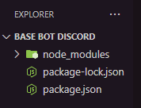
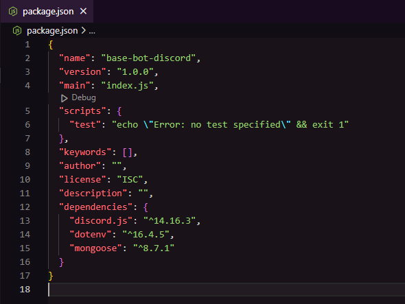

# Base Discord Bot (discord.js v14)

*Ce projet est une base pour un bot Discord utilisant discord.js v14 et MongoDB. Le dépôt inclut la structure de base, l'initialisation du projet et l'installation des dépendances nécessaires pour commencer à développer.*

> [!CAUTION]
> ## Prérequis
> Avant de commencer, assurez-vous d’avoir installé les outils suivants :
> - [Node.js](https://nodejs.org/fr) : Version 16 ou plus récente.
> - [Git](https://git-scm.com/downloads) : Pour cloner et gérer le dépôt.
> - [MongoDB](https://www.mongodb.com/fr-fr/cloud/atlas/register) : Base de données pour stocker les informations de manière persistante.
> - [VS Code](https://code.visualstudio.com/download) : (Recommandé) pour l'édition du code.

---

## Étape 1 : Initialisation du projet

Initialisez un projet Node.js dans le répertoire principal :

```bash
npm init -y
```

### Explication :

`npm init` : Initialise un nouveau projet Node.js et crée un fichier package.json. \
`-y` : Cette option répond automatiquement "oui" aux questions par défaut, ce qui accélère l'initialisation.

> [!NOTE]
> Le fichier package.json est essentiel, il contient des informations sur le projet et ses dépendances.

---

## Étape 2 : Installation des dépendances

Installez les dépendances suivantes avec npm :

```bash
npm install discord.js mongoose dotenv
```

### Explication :

- **discord.js** : La bibliothèque principale pour interagir avec l'API Discord.
- **mongoose** : Un ORM pour interagir avec MongoDB de manière simple.
- **dotenv** : Utilisé pour gérer les variables d'environnement, comme le token du bot.

---

## Étape 3 : Explication des dossiers et fichiers
> [!NOTE]
> Actuellement votre projet doit ressembler à ceci:


> [!NOTE]
> Vous ne retrouverez pas le dossier node_modules dans ce GitHub mais il doit être présent dans votre projet
> Et dans votre package.json, vous devez avoir ceci:



- /node_modules : Dossier généré par npm contenant les modules installés. Ne pas le modifier.
- package.json : Fichier généré par npm init, il répertorie les dépendances du projet et les scripts npm.
- package-lock.json : Généré par npm, il verrouille les versions exactes des dépendances installées.

---

## Prochaines étapes
- Préparer les fichiers de base pour enfin coder.